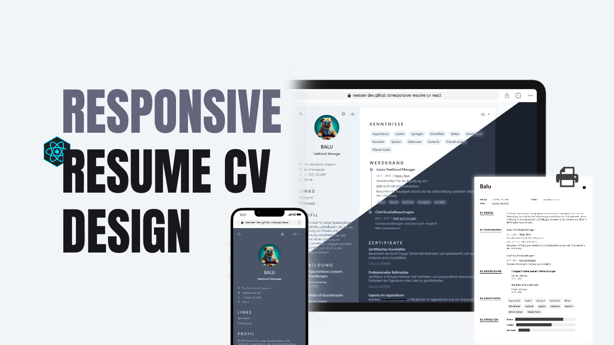

# Multilingual Resume Web App



This project is a modern, responsive, and multilingual resume web application built with React. It is designed to be
highly configurable through simple JSON files and supports automatic theme detection, manual theme selection, and
dynamic content loading based on language preference.

## Table of Content

- [Features](#features)
- [Getting Started](#getting-started)
- [Configuration](#configuration)
- [Tech Stack](#tech-stack)
- [Project Structure](#project-structure)
- [Save as PDF / Print](#save-as-pdf--print)
- [Credits](#credits)
- [Open Source](#open-source)
- [Note](#note)

## Features

- **Multilingual Support**: Languages can be configured in `config.json`. Available languages are automatically loaded
  from this configuration.
- **Theme Detection and Selection**: The application can automatically detect the user's preferred theme (light or dark)
  based on browser settings (`defaultTheme: auto` in `config.json`) or allow for manual theme selection.
- **Downloadable PDF**: Users can download their resume as a PDF on desktop versions.
- **Customizable Sections**: Titles for each section can be specified in `locales.json`.
- **CV Information**: User CV information is entered into `cv.json`.
- **Profile Image**: The profile image can be set by replacing `profile.jpg` in the public assets.
- **Configurable Title**: The website title can be changed in the `/public/index.html` file within the `<title>` tag.
- **Base URL Independence**: The web app is configured to run without a "baseurl", making it easy to deploy on various
  platforms.
- **Deployment Ready**: A `deploy.yml` file for GitHub Pages is included for easy CI/CD setup.

### ToDo´s:

- **CV Wizard**: Wizard which helps creating a new CV
- **More Themes**: Add additional Themes and more Themes options (like fonts for sections)

## Getting Started

To run the project locally in development mode, execute the following command:

`
npm run start`

To build the static content for production, use:

`npm run build`

## Configuration

- `config.json`: Configures the available languages and theme settings.
- `locales.json`: Contains the titles and content for each section in different languages.
- `cv.json`: Holds the personal information, education, experience, and other CV-related data.
- `themes`: Located in `/public/themes`, where you can customize or add new themes.

## Tech Stack

- **React**: A JavaScript library for building user interfaces, chosen for its component-based architecture.
- **TypeScript**: A typed superset of JavaScript that compiles to plain JavaScript, used for its scalability and
  developer experience.
- **HTML2Canvas**: A JavaScript library that allows for capturing the rendered HTML and styling of web components to
  generate images or PDFs.
- **jsPDF**: A library to generate PDF documents using JavaScript, enabling the download of the resume in PDF format.
- **CSS/SCSS**: Used for styling components with the ability to use variables, nested rules, mixins, and more for
  maintainable stylesheets.
- **GitHub Actions**: For continuous integration and deployment (CI/CD), allowing automated building and deployment to
  GitHub Pages.
- **LocalStorage**: To persist user preferences like theme and language selection across sessions.

## Project Structure

- `/public`: Contains the static files like themes, `index.html`, and images.
- `/src`:
    - `/components`: React components for each section of the resume, such as education, experience and so on.
    - `/hooks`: Custom React hooks, for example, `useLanguage` to manage language state.
    - `/models`: TypeScript interfaces and types defining the structure of the CV data.
    - `/utils`: Utility functions, including the local loader for loading JSON data.
    - `App.tsx`: The main React component that wraps the entire application.
    - `config.json`: Configuration file to set available languages and theme preferences.
    - `index.tsx`: The entry point of the React application.
- `/themes`: Directory inside `/public` where different CSS theme files are stored.
- `deploy.yml`: GitHub Actions workflow for deployment.
- `package.json`: Lists dependencies, scripts, and project metadata.

The project is structured to promote ease of maintenance, scalability, and separation of concerns. Each part of the
resume is a component that can be individually customized or replaced as needed.

## Save as PDF / Print

For printing, some parts of the application utilize media print queries to apply specific styles suitable for print. The
print functionality is recommended over the PDF generation function for a few reasons:

1. **Text Searchability**: When using the print function and saving as a PDF, the result is a searchable text document.
   This is not the case with the screenshot-to-PDF method, which results in an image-based PDF where text cannot be
   searched or selected.

2. **File Size**: The print-to-PDF method generally produces a much smaller file compared to the screenshot method.

3. **Mobile Compatibility**: The print method works on mobile devices, allowing users to print directly from their
   mobile browsers.

4. **Faster and Simpler**: It avoids the overhead of generating an image from the canvas and then converting it to a
   PDF.

Here’s how the print functionality is implemented:

```
const printAction = () => {
// Set print mode and load print theme
setIsPrintMode(true);
loadTheme("print");

// Wait for the theme to load, then trigger the print
setTimeout(() => {
window.print();

    // Reset to the previous theme and print mode after printing
    setTimeout(() => {
      setIsPrintMode(false);
      loadTheme(theme);
    }, 100);

}, 100);
};
```

For PDF generation, the application uses `html2canvas` to take a screenshot of the relevant area and then `jspdf` to
create a PDF:


```
const generatePdf = () => {
const areaCv = document.getElementById('area-cv');
if (areaCv && cvData) {
document.body.classList.add('generate-pdf');
html2canvas(areaCv, {scale: 1, useCORS: true}).then(canvas => {
// PDF generation logic...
});
}
};
```

The resulting PDF from `generatePdf` is image-based and typically much larger in file size than the print-to-PDF
version. Therefore, while both functionalities are available, users are advised to utilize the print option for a better
experience, especially when looking to save the document as a PDF for sharing or storage purposes.

## Credits

This project is inspired by and adapted from the template provided
by [bedimcode](https://github.com/bedimcode/responsive-resume-cv-smith). The original design was rebuilt using React to
enhance its interactivity, responsiveness, multilingual capabilities, and configurability.

## Open Source

This project is open source and welcomes contributions from the community. Feel free to fork the repository, make your
changes, and submit a pull request.

## Note

Remember that this project is meant to serve as a starting point. You are encouraged to customize and extend it to fit
your needs and reflect your personal brand.

Readme.md generated by ChatGPT
